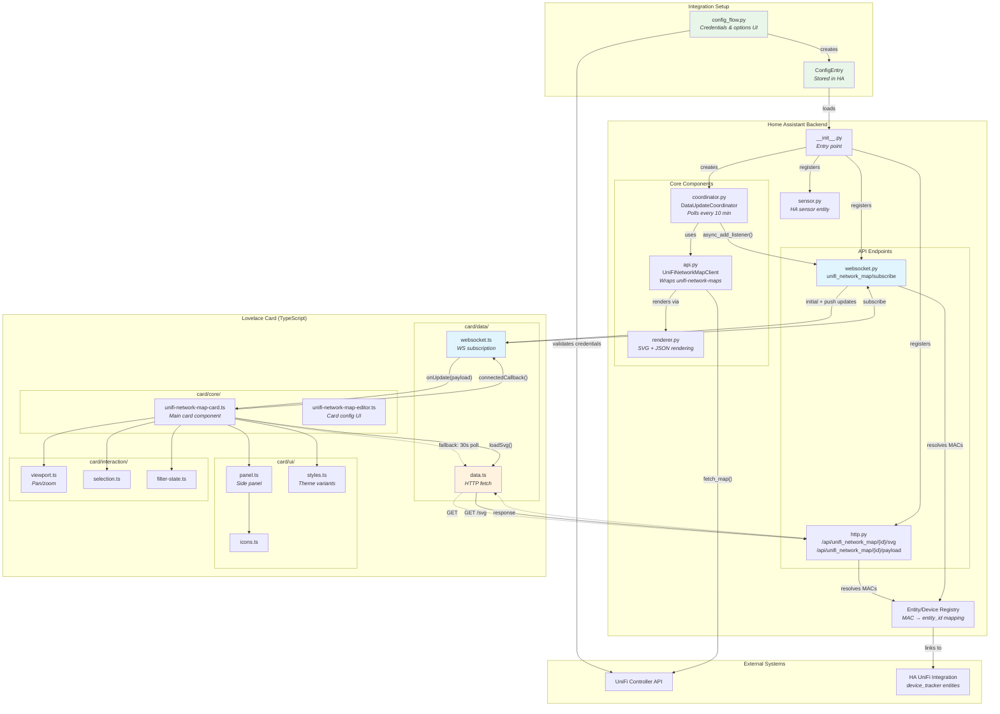
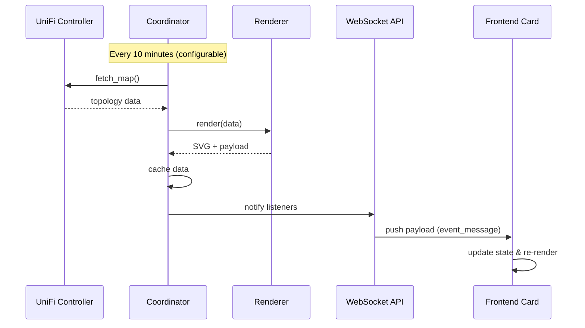

# Contributing

Thanks for helping improve UniFi Network Map for Home Assistant.

## Project layout
```
custom_components/unifi_network_map/   # HA integration
frontend/                               # Lovelace custom card source (TS)
custom_components/unifi_network_map/frontend/  # Built card bundle for HA
.github/workflows/                      # CI (hassfest + hacs)
hacs.json                               # HACS metadata
```

## Development setup
- Python: use `make install-dev` to create `.venv` and install dependencies.
- Python 3.12+ is required (3.13 preferred).
- Frontend: run `make frontend-install` to install Node dependencies.

## Pre-commit hooks
We use `pre-commit` to keep local checks consistent with CI. It runs:
- Hassfest via Docker (`ghcr.io/home-assistant/hassfest:latest`)
- Python tests (`make test`)
- Frontend tests (`make frontend-test`)

Enable it once:
```bash
pip install -r requirements-dev.txt
pre-commit install
```

Or use the Makefile (no activation required):
```bash
make pre-commit-install
make pre-commit-run
```

Run all hooks manually:
```bash
pre-commit run --all-files
```

## Testing
- Python: `make test`
- Frontend: `make frontend-test`
 - Build bundle for HA: `make frontend-build` (copies to `custom_components/unifi_network_map/frontend/`)

## Architecture notes
- The integration renders SVG + JSON via `unifi-network-maps`.
- Endpoints are served at `/api/unifi_network_map/<entry_id>/svg` and `/payload`.
- The card resource is auto-registered and served from
  `/unifi-network-map/unifi-network-map.js`.
- Keep the integration self-contained for HACS and avoid logging secrets.

### Architecture Diagram



### Component Reference

| File | Purpose |
|------|---------|
| **config_flow.py** | Multi-step setup wizard: credentials validation, site selection, render options |
| **coordinator.py** | `DataUpdateCoordinator` subclass; polls UniFi API, manages auth backoff, notifies listeners |
| **api.py** | Thin wrapper around `unifi-network-maps` library; handles SSL and caching options |
| **renderer.py** | Transforms topology data into SVG string and JSON payload with node metadata |
| **http.py** | Two `HomeAssistantView` endpoints for SVG and payload; resolves MAC→entity mappings |
| **websocket.py** | WebSocket subscription command; pushes payload on coordinator updates |
| **sensor.py** | Exposes integration status as HA sensor entity with device count attributes |

### Data Flow



### Key Integration Points

| Integration Point | Details |
|-------------------|---------|
| **UniFi Integration** | Official HA `unifi` domain provides `device_tracker` entities; we link via MAC address |
| **Entity Registry** | Maps MAC addresses to entity IDs for status badges and "View in HA" links |
| **Lovelace Resources** | Card JS bundle auto-registered at `/unifi-network-map/unifi-network-map.js` |
| **WebSocket** | Uses HA's built-in WebSocket infrastructure; `resubscribe: true` handles reconnects |

### Frontend Module Structure

```
frontend/src/card/
├── core/           # Main card, editor, types, state
├── data/           # Auth, data fetching, WebSocket, sanitization
├── interaction/    # Pan/zoom, selection, filters, context menu
├── ui/             # Panel, icons, styles, modals
└── shared/         # Constants, localization, utilities
```

### Update Mechanisms

| Mechanism | Trigger | Latency | Use Case |
|-----------|---------|---------|----------|
| **WebSocket push** | Coordinator refresh | Instant | Primary update path |
| **HTTP polling** | 30s interval | Up to 30s | Fallback if WS unavailable |
| **Manual refresh** | Service call `unifi_network_map.refresh` | Instant | User-triggered refresh |

### Theming

Four theme variants controlled by card config:
- `dark` - Dark background, light text
- `light` - Light background, dark text
- `unifi` - UniFi brand colors (dark)
- `unifi-dark` - UniFi brand colors (darker)

Theme is applied via `data-theme` attribute on `ha-card` element.

## Workflow guidelines
- Preferred branch: `TBD` until we settle on a release flow.
- We prefer rebasing over merge commits.
- PRs are for unknown contributors; regular contributors can push directly.
- Commit style: small and focused. Many small commits are preferred; no squashing.
- Prefer opening PRs against `unifi-network-maps` instead of adding custom plumbing here.
